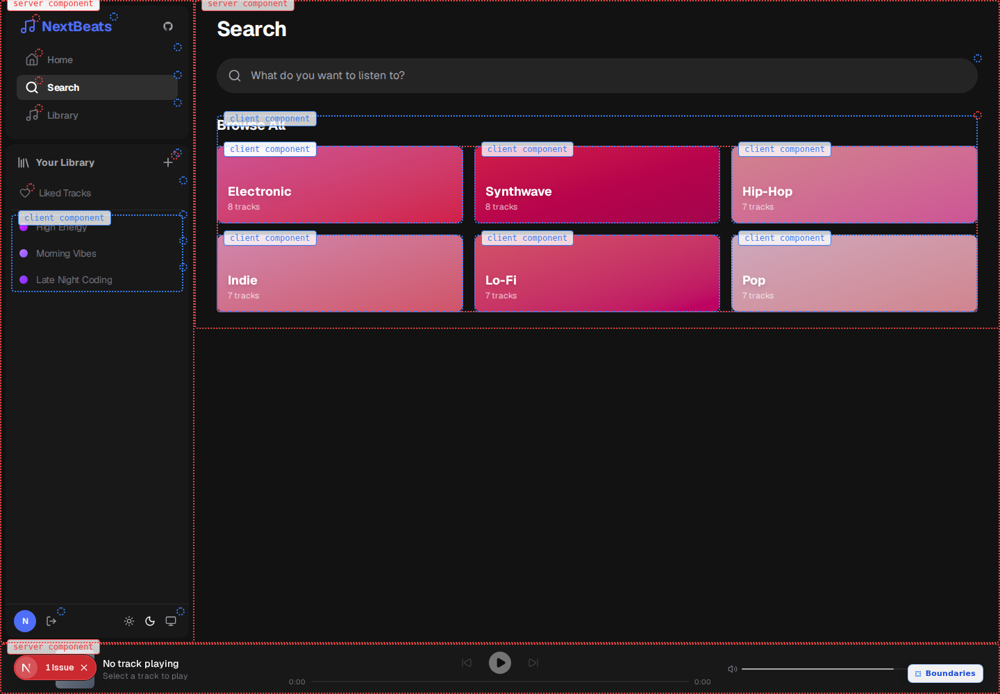
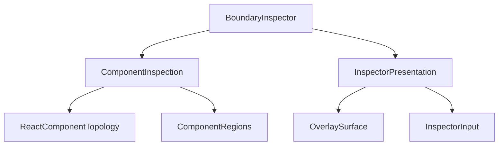

# RSC Inspector

RSC Inspector is a development-only Next.js plugin that draws the rendered
boundaries between React Server Components and Client Components. It reads the
live React development tree, so application components need no annotations and
the inspector adds no wrapper elements to application markup.



## Requirements

- Next.js `>=16.3.0 <17`
- App Router
- Development mode

The first release targets React 19 through the React version shipped by the
supported Next.js range.

## Install

```bash
pnpm add -D next-rsc-inspector
```

`npm install --save-dev next-rsc-inspector` and
`yarn add --dev next-rsc-inspector` work as well.

## Add the plugin

Wrap your existing Next.js configuration:

```ts
// next.config.ts
import type { NextConfig } from "next"
import { withRscInspector } from "next-rsc-inspector/plugin"

const nextConfig: NextConfig = {
  // Keep your existing options here.
}

export default withRscInspector(nextConfig)
```

Run the normal development server. The plugin uses Next.js
`instrumentationClientInject` to install before React hydration and preserves
any instrumentation modules already configured by the application.

## Use the inspector

Click **Boundaries** in the lower-right corner or press `Alt + Shift + X`.
Press `Escape` to hide it.

- Blue dotted regions are Client Components entered from server rendering.
- Red dotted regions are server-rendered slots passed through Client
  Components.
- A card appears only where the environment changes.
- If several logical components share one rectangle, the outermost transition
  is shown first. Click it to cycle through that component stack.

The outline follows the DOM border box. CSS margins are outside the outline;
padding and borders are inside it.

## How it works

The plugin injects a small browser bootstrap before hydration. Its Effect
runtime composes three local convergence points:



`ReactComponentTopology` reads the React development hook and reconstructs the
combined server/client hierarchy. `ComponentRegions` maps logical component
instances to their nearest host DOM roots. `ComponentInspection` joins those
streams into the scene consumed by the overlay.

This integration depends on private React development metadata. Unsupported
React or Next versions may require a compatibility update.

## Contributing

Development must run inside WSL Ubuntu. The repository expects the native WSL
Node.js and pnpm toolchain, not Windows executables mounted under `/mnt/c`.

See [CONTRIBUTING.md](CONTRIBUTING.md) for the factual module map and routing
guide for topology, geometry, overlay policy, DOM rendering, and Effect
lifecycle changes.

```bash
git clone git@github.com:Rust-soham/rsc-inspector.git
cd rsc-inspector
corepack pnpm install
corepack pnpm check
corepack pnpm test
corepack pnpm build
```

The fixture lives in `fixtures/next-app`. Its Playwright test verifies live
server/client topology, transition-only cards, geometry deduplication, the
keyboard toggle, and overlay cleanup. Turbopack has fixture and real-application
coverage; webpack has a fixture-level development smoke test.

When changing architecture, begin at the nearest upper workflow and derive the
services it needs. Service classes expose `layerNoDeps` for their unfinished
dependency graph and `layer` for the locally completed graph. Keep geometry,
classification, and other pure transformations as ordinary functions.

The non-obvious maintenance boundaries are intentionally commented in source:

1. React Fiber discovery and React 19 server debug chains.
2. Nearest-host-root geometry, which prevents claiming an entire DOM subtree.
3. Shared-rectangle grouping, which prefers an environment transition and
   cycles the remaining logical components.

## Publishing

From a clean checkout:

```bash
corepack pnpm check
corepack pnpm test
corepack pnpm --filter next-rsc-inspector pack --dry-run
corepack pnpm --filter next-rsc-inspector publish
```

The package runs its build during `prepack` and its typecheck and unit tests
during `prepublishOnly`. Publishing to npm still requires an authenticated npm
account with ownership of `next-rsc-inspector`.

## License

MIT
